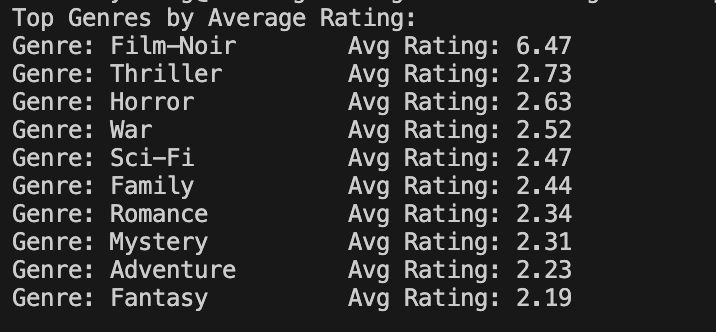
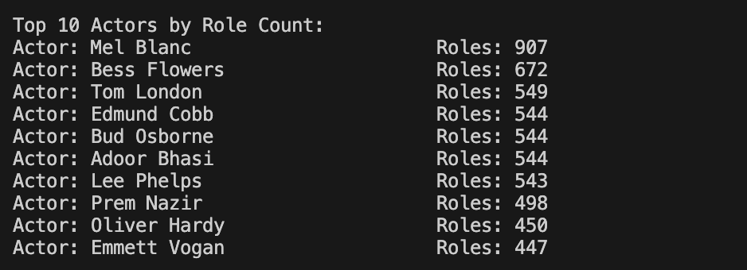
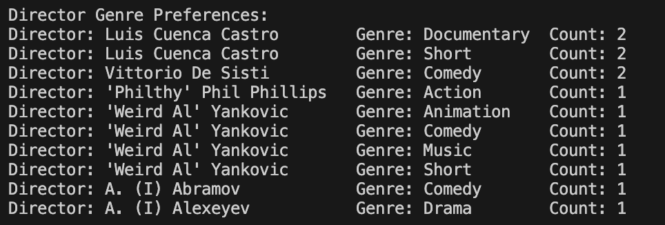
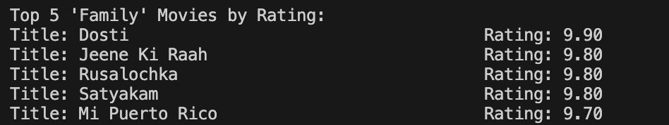
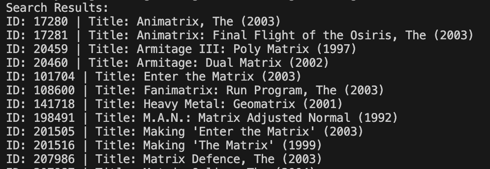
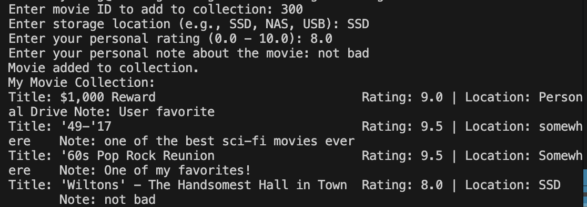

# A Personal Movie Database with Go

## **Project Overview**

This project implements a personal movie database application using the Go programming language and a cgo-free SQLite driver (`modernc.org/sqlite`). The project is based on publicly available IMDb data files ([https://arch.library.northwestern.edu/concern/datasets/3484zh40n?locale=en](https://arch.library.northwestern.edu/concern/datasets/3484zh40n?locale=en "https://arch.library.northwestern.edu/concern/datasets/3484zh40n?locale=en")), which include detailed information about movies, genres, actors, roles, directors, and director genre preferences.

**The application loads data from six CSV files:**

1. IMDB-movies.csv – includes movie IDs, titles, release years, and ratings.
2. IMDB-movies\_genres.csv – maps movies to their genres (many-to-many).
3. IMDB-actors.csv – includes actor IDs, first/last names, and gender.
4. IMDB-roles.csv – maps actors to movies and roles (many-to-many).
5. IMDB-directors.csv – contains director IDs and names.
6. IMDB-directors\_genres.csv – links directors to genres they prefer.

**In addition to the core IMDb data, the project defines a custom table**`my_collection`, which allows users to track their personal movie collection, including:

- Where each movie is stored.
- The user's personal rating.
- A brief personal note or comment.

**The Go application contains the following main components:**

- `main.go`: orchestrates database initialization, data import, and runs queries or user input.
- `db.go`: defines all relational schema creation in SQLite.
- `import.go`: contains functions to import each CSV file into the corresponding SQLite table.
- `query.go`: provides multiple SQL query functions, including:
  - Highest-rated genres
  - Most active actors (by number of roles)
  - Most frequent director-genre combinations
  - Highest-rated movies within a given genre
  - Searching movies by title
  - Adding a movie to a personal collection
  - Viewing the collection

## **How to Test and Use the Application**

### Run the application:

This repository already includes pre-built executables:

**On macOS/Linux:**

```bash 
go build -o movieapp #build
./movieapp           #run
```


**On Windows:**

```bash 
GOOS=windows GOARCH=amd64 go build -o movieapp.exe
```


**Or run directly:**

```bash 
go run *.go
```


The application will:

- Automatically create the database schema
- Import data from all six CSV files
- Display top-rated genres and most active actors
- Prompt the user to enter a movie ID and details to add it to their personal collection

You can manually verify that the collection was updated by running the `QueryMyCollection()` function or querying the SQLite database using a CLI tool or VS Code plugin.

### Unite Test:

Unit tests for core functions are provided in `main_test.go`, and can be run using:

```bash
go test -v
```


## Features

This movie application supports the following key features:

1. **Full Data Import from IMDb Archive** &#x20;

   The program loads six large datasets into a local SQLite database, covering movies, genres, actors, roles, directors, and director genre preferences.
2. **Relational Schema Construction** &#x20;

   All tables are defined in SQLite with appropriate foreign key relationships, like:
   - Movies to genres (many-to-many)
   - Actors to roles (many-to-many)
   - Directors to genres (many-to-many)
3. **SQL Query Capabilities** &#x20;

   The application provides analytical queries including:
   - Top genres by average movie rating
    ```go
    QueryTopGenres(db)
    ```
    
   - Top actors by number of roles
   ```go
    QueryTopActors(db)
    ```
    
   - Directors with the most genre preferences
   ```go
    QueryDirectorPreferences(db)
    ```
    
   - Highest-rated movies within a selected genre
   ```go
    QueryTopMoviesByGenre(db, "Family")
    ```
    
4. **Movie Search Functionality**

   Users can enter keywords to search for movies by title and view corresponding IDs and years.
   

   **In future versions**, the search feature will be enhanced to not only return basic movie metadata, but also display **all associated personal reviews and comments** stored in the`my_collection`table. This will allow users to immediately see:
   - Whether they have already rated or stored the movie
   - What notes or impressions they previously left
   - How their own evaluation compares with public IMDb ratings
5. **Personal Movie Collection Management** &#x20;

   A custom table`my_collection`allows users to:
   
   - Add a movie by ID to their personal library
   - Specify where the movie is stored
   - Assign a personal rating
   - Write a brief note
   
6. **Interactive CLI Interface** &#x20;

   The application prompts the user to enter inputs directly in the terminal, and validates them (e.g., checks if rating is within 0–10 range).
7. **Unit Testing Support** &#x20;

   Critical functions (database insertions) can be tested via Go’s built-in testing framework. The application is designed to be modular and testable.

## **Purpose and Use Cases of this Personal Movie Database**

While IMDb serves as a universal catalog, this project extends its utility by enabling **personalization, local control, and private annotation**.

The primary purpose of the personal movie database is to allow users to:

- Keep track of which movies they personally own or have archived.
- Rate movies based on their own preferences, not just public consensus.
- Add notes for future reference (“Rewatch with family,” “Part of Scorsese collection,” etc.).
- Store metadata about where the movie is kept (external SSD, cloud, home NAS).

This is especially useful for:

- Home media collectors
- Film students organizing watchlists and reviews
- Users building curated archives of niche genres (foreign language films, documentaries)

By integrating this layer of personal context, the database serves as a hybrid of **movie catalog + diary + inventory system.**

**While IMDb is a universal resource, it does not offer:**

- Custom tagging
- Personal review tracking
- Offline access or control

This application is therefore **a personal overlay to IMDb**, a movie manager tailored to individual needs.

## **Possible User Interactions**

Although SQL is the core engine for data manipulation, the application envisions a richer user experience through structured CLI or future GUI interactions:

- **Search-Based Input**: Users can search movies by title using keywords (like “Star Wars”) and receive a list of matched results with ID and release year.
- **Interactive Collection Additions**: The app prompts the user to select a movie from search results and input their rating, note, and storage location.
- **Personal Review Retrieval**: The user can list all movies in their collection, sorted by rating, title, or genre.
- **Tag-Based Filtering**: With further development, notes or genres could be parsed as tags for filtering (e.g., “Show all sci-fi with rating > 8”).

## Future Application Development

As a foundation for a personalized movie management tool, the current database schema is intentionally simple and relational. However, the following enhancements (and the enhancement mentioned above) are planned to increase its functionality and long-term value:

**1. Support for Multiple Users**
Introduce a `users` table and add `user_id` as a foreign key in the `my_collection` table. This will allow multiple individuals to maintain independent movie collections, ratings, and notes within the same database instance, which is ideal for shared devices, households, or collaborative film study groups.

```sql 
CREATE TABLE users (
  id INTEGER PRIMARY KEY,
  username TEXT UNIQUE,
  email TEXT
);
```


**2. Movie Review System**
Extend `my_collection` to include a formal `review_text`, `review_date`, and possibly a `review_score` separate from the numerical rating. This would support full review history and journaling capabilities. With indexing, reviews could be searchable and sortable by keywords, dates, or sentiment.

**3. Genre-Based Recommendations**
With a populated `my_collection`, the app could analyze genres most frequently liked and recommend unrated movies of the same type. This could be implemented using simple SQL joins and filtering logic, without requiring machine learning.

**4. CLI Expansion with Argument Parsing**
Transform the current interactive prompt-based application into a full-featured command-line tool with flags and subcommands:

```bash 
movieapp search --title="Blade Runner"
movieapp add --id=123 --location="NAS" --rating=9.1 --note="Rewatch-worthy"
movieapp list --collection --filter="genre=Drama"
```


This makes the tool easier to script and automate, especially for power users.

**5. Cloud Sync or Backup**
Enable scheduled exports of user collection to JSON or CSV, and integrate optional sync to cloud storage (e.g., Dropbox, Google Drive) for backup and multi-device access.

## **GenAI Tools Used**

This project was developed with the assistance of ChatGPT and Copilot. AI support was used in the following ways:

- **Code Generation and Refactoring** &#x20;

  ChatGPT was used to help write idiomatic Go code for importing CSV files, constructing relational schema, and performing SQL queries with proper error handling and logging.
- **Debugging Support** &#x20;

  During import logic development, Copilot was helpful in identifying data format mismatches, such as malformed CSV rows, missing columns, or SQL constraint violations.
- **README Composition** &#x20;

  The documentation, especially feature summaries and future roadmap, was collaboratively written with AI, based on the actual structure and behavior of the program.

All responses were reviewed and manually integrated into the project by the author.
